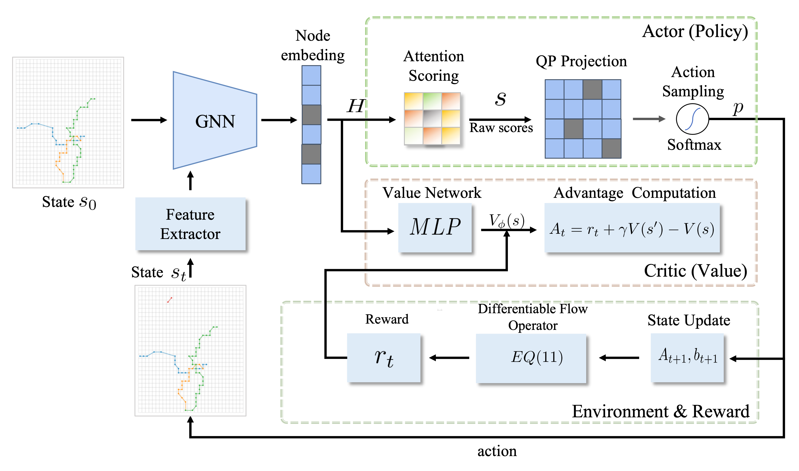
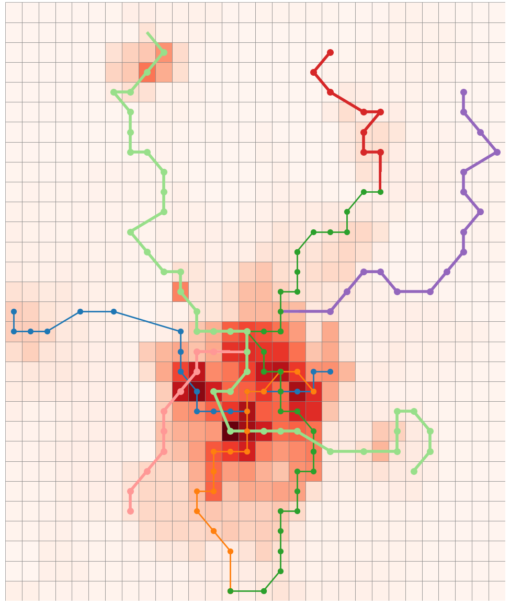

# CDFP-Net-
onstrained Differentiable Flow Planning Framework for Metro Network Expansion

 we introduce CDFP‐Net, a unified, end‐to‐end differentiable reinforcement learning framework that jointly optimizes expansion decisions and passenger flow redistribution under hard constraints on station spacing, turn angle, and budget. Experiments on a real‐world Chongqing city expansion scenario show that CDFP‐Net achieves up to 15\% higher OD satisfaction compared to leading integer‐programming, heuristic, and deep RL baselines.
 

The code will be coming soon. Stay tuned!
